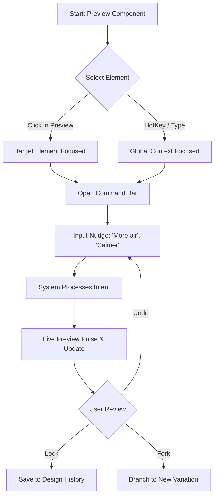
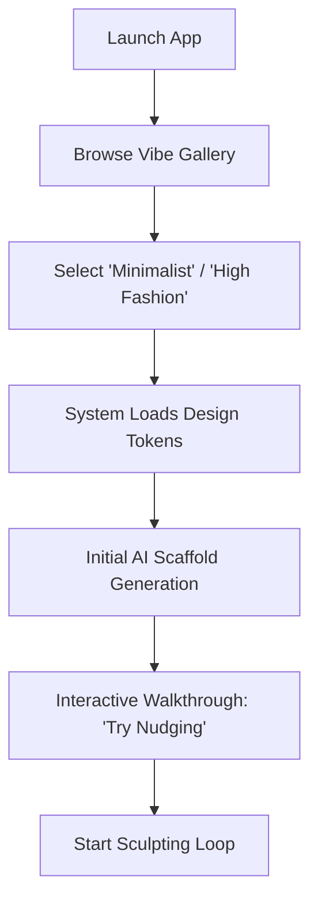
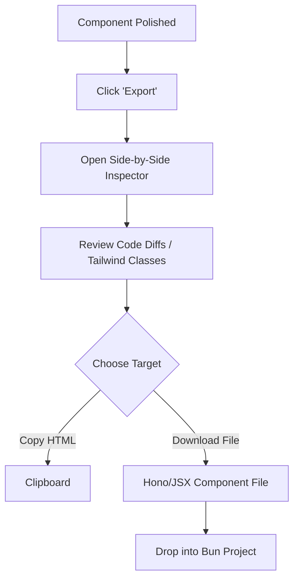

---
stepsCompleted:
  - 1
  - 2
  - 3
  - 4
  - 5
  - 6
  - 7
  - 8
  - 9
  - 10
  - 11
  - 12
  - 13
  - 14
inputDocuments:
  - prd.md
  - product-brief-02-2026-01-15.md
  - technical-Chat-first-frontend-UX-UI-builder-research-2026-01-15.md
---

# UX Design Specification 02

**Author:** Hani
**Date:** 2026-01-15

---

## Executive Summary

### Project Vision
Project 02 is a chat-first frontend UX/UI builder that bridges the "AI Handover Gap." It empowers developers and non-techies to achieve professional-grade UI polish through incremental, intent-based chat "nudges" (e.g., "make it calmer," "tighter spacing") rather than destructive full-component rewrites. The goal is to provide a seamless transition from AI generation to production-ready, human-readable code.

### Target Users
- **The Polish-Fatigued Dev (Marcus):** Skilled developers who want precise spatial control and clean, hand-written quality HTMX/Hono code without the "AI garbage."
- **The Design-Locked Non-Techie (Maya):** Users with a strong visual vision but no CSS skills who need to translate "vibes" into professional interfaces.
- **The Speed-Demon Indie Maker (Leo):** Rapid prototypers who need unique visual signatures and responsive layouts in minutes.

### Key Design Challenges
- **Subjective Intent Mapping:** Translating abstract terms like "premium" or "balanced" into deterministic CSS property shifts.
- **Streaming Stability:** Maintaining a fluid, non-jarring preview experience during real-time code generation and HTMX fragment injection.
- **Versioned Iteration:** Designing an intuitive undo/redo system that tracks design "moves" rather than just text changes.

### Design Opportunities
- **Vibe-Driven Onboarding:** Starting the user journey with high-end curated design systems to eliminate "blank canvas" anxiety.
- **Hypermedia Transparency:** Using the clean nature of HTMX/Hono code as a core UX feature, making the "Export" feel earned and trustworthy.
- **Edge-First Latency:** Leveraging Cloudflare Durable Objects to provide a sub-200ms "Live Preview" loop that feels like a local design tool.

## Core User Experience

### Defining Experience
The core user experience revolves around the "Chat-Preview Loop"—a high-fidelity, interactive environment where users "sculpt" UI components through natural language conversation. The experience is designed to feel like a high-end design tool that understands developer intent and design systems natively.

### Platform Strategy
- **Platform:** Desktop-first web application (optimized for Marcus and Leo's workflow).
- **Control Model:** Keyboard-centric chat interactions paired with mouse-driven preview inspection and component selection.
- **Latency Target:** Sub-200ms visual feedback utilizing Cloudflare Durable Objects and HTMX fragment injection.
- **Device Support:** Desktop UI with integrated high-fidelity mobile and tablet device simulators.

### Effortless Interactions
- **Subjective Intent Interpretation:** The system seamlessly translates design vibes (e.g., "more air," "premium") into precise CSS property adjustments without user intervention in the code.
- **Zero-Refresh Synchronization:** Code views and previews remain in continuous, bi-directional sync during AI generation and user edits.
- **Filter-like Initialization:** Starting a project from a "Vibe Template" feels as simple as applying a photo filter, requiring zero initial design system configuration.

### Critical Success Moments
- **The Precise Nudge:** The moment a user asks for a subtle spatial change and the AI executes it perfectly without structural regression.
- **The Zero-Cleanup Export:** When the user drops the exported Bun/Hono/HTMX code into their project and it runs instantly with human-quality readability.
- **Design System Drift Recovery:** Successfully using "Undo" to revert an experimental design path without losing session state or logical integrity.

### Experience Principles
- **Hypermedia Immediacy:** Interaction loops must be near-instant to maintain creative flow.
- **Structural Stability:** UI updates are surgical and non-destructive; logic and hierarchy are preserved across AI iterations.
- **Intent Over Implementation:** Users describe *what* they want the UI to feel like; the system manages *how* it's implemented in CSS/JSX.
- **Ownership-Ready Output:** Every byte of generated code is designed to be owned and maintained by professional human developers.

## Desired Emotional Response

### Primary Emotional Goals
- **Empowered and In Control:** Users feel like the lead designer with a high-skill assistant. Interaction feels like "sculpting," not "gambling."
- **Efficient and Productive:** The edge-first speed creates a superpower feel—moving from vibe to polished UI in minutes.
- **Professional Pride:** Users feel a sense of pride in the artisanal, human-quality code output.

### Emotional Journey Mapping
- **Discovery:** "Wait, this actually understands what I mean by 'calmer'?" (Delight & Surprise).
- **Iteration (Nudging):** "I'm in the flow. I'm tweaking pixels without the CSS friction." (Focus & Confidence).
- **Finalization (Export):** "This is production-ready. I just saved hours of polish." (Relief & Accomplishment).
- **Recovery:** "The AI missed the mark, but I can revert instantly." (Safety & Trust).

### Micro-Emotions
- **Confidence Over Confusion:** Clear visual highlighting of exactly *what* changed during a nudge.
- **Trust Over Skepticism:** Live code previews that validate the AI's "clean code" promise in real-time.
- **Delight Over Satisfaction:** High-performance, subtle visual transitions when the preview state updates.

### Design Implications
- **Visual Diffing:** Always providing a way to see "Before vs. After" for every chat-driven adjustment.
- **Structural Locking:** Visually signaling that the core component hierarchy is protected during style-only nudges.
- **Variation Selection:** Offering multiple "interpretations" of a nudge (e.g., "3 ways to make this more premium") to maximize user agency.

### Emotional Design Principles
- **The Undo Safety Net:** Users must feel it is impossible to irrecoverably "break" the UI.
- **Zero Friction Flow:** Eliminating all visible loading states to maintain the user's creative connection.
- **Intentional Craftsmanship:** The tool's own UI and the generated output must avoid the generic "AI-generated" look in favor of intentional design.

## UX Pattern Analysis & Inspiration

### Inspiring Products Analysis
- **Cursor (The AI IDE):** Seamlessly blends AI Suggestions with manual code. **Transferable Pattern:** Visual Code Diffs adapted for layout previews.
- **Figma (The Design Standard):** Direct manipulation and contextual properties. **Transferable Pattern:** Contextual Property Inspection where selecting a component targets it for the next chat nudge.
- **v0.dev / Bolt.new (The Benchmarks):** Fast generation and history thumbnails. **Transferable Pattern:** Visual Versioning allowing users to "fork" design paths.

### Transferable UX Patterns
- **Visual Diffing (from Cursor):** Highlighting specific layout/style changes in the rendered UI during a nudge.
- **Direct Selection (from Figma):** Clicking a preview component auto-fills the chat context for the next command.
- **Thumbnailed History (from v0):** Visual timeline of design iterations for easy recovery and branching.

### Anti-Patterns to Avoid
- **Jarring Full-Page Rerenders:** We will use surgical HTMX updates instead of full-page rewrites.
- **Opaque Generated CSS:** We will prioritize Tailwind/Semantic CSS over inline "black box" styles.
- **Chat-Only Isolation:** We will combine chat with point-and-click component targeting.

### Design Inspiration Strategy
- **What to Adopt:** Figma's "direct manipulation" feel for component selection.
- **What to Adapt:** Cursor's "Apply Diff" logic, translated into a "Visual Diff" overlay in the preview.
- **What to Avoid:** The opaque, difficult-to-maintain code output common in early AI generators.

## Design System Foundation

### Design System Choice
The project will utilize a **Hybrid Tailwind CSS foundation** paired with **Shadcn-inspired HTMX component primitives**.

### Rationale for Selection
- **Deterministic "Nudging":** Tailwind's utility-first nature allows the AI to apply precise visual adjustments by simply swapping classes (e.g., `p-4` to `p-2`), which is more stable than generating raw CSS.
- **HTMX Synergy:** Utility classes are self-contained within HTML fragments, making the "Hypermedia-Driven" updates fast and lightweight.
- **Developer Trust:** Professional developers (Marcus) prefer Tailwind for its portability and predictability compared to opaque CSS-in-JS or inline styles.

### Implementation Approach
- **Design Token Mapping:** Subjective intent terms (e.g., "calm", "premium") will map to specific Tailwind configuration sets (colors, spacing scales, border-radii).
- **Fragment Primitives:** High-quality, accessible HTML/HTMX fragments (Shadcn-style) will serve as the AI's structural building blocks.

### Customization Strategy
- **The "Vibe" Layer:** Users initialize projects with "Vibe Templates" which are essentially pre-configured Tailwind themes.
- **Surgical Overrides:** AI "nudges" will apply utility classes directly to the DOM elements, providing a clear and inspectable trail of changes.

## 2. Core User Experience

### 2.1 Defining Experience
The defining experience of **02** is: **"Sculpt UI through Intent-Based Nudges."** It is a high-fidelity interaction loop where users point at UI elements and use natural language to precisely adjust visual properties without writing code.

### 2.2 User Mental Model
Users should view **02** as **"Digital Clay."** They move away from the "slot machine" model of AI generation towards an iterative sculpting process where the AI acts as a design-aware assistant that understands spatial intent and visual hierarchy.

### 2.3 Success Criteria
- **Nudge Accuracy:** >80% success rate in translating chat intent into the user's desired CSS/Tailwind shift on the first try.
- **Flow Latency:** Sub-200ms visual feedback loop to maintain a "direct manipulation" feel.
- **Logical Integrity:** 100% preservation of business logic and component structure during style-only visual iterations.

### 2.4 Novel UX Patterns
- **Direct-to-AI Selection:** Clicking a preview element automatically sets the contextual "target" for the subsequent chat command.
- **Subjective-to-Scale Translation:** An algorithmic mapping of abstract terms (e.g., "tighter") to deterministic steps on a Tailwind design scale.

### 2.5 Experience Mechanics
1. **Initiation:** User selects an element in the live preview or hits a hotkey to focus the chat.
2. **Interaction:** User provides a natural language nudge (e.g., "add more air here").
3. **Feedback:** The targeted element pulses, surgical Tailwind class swaps occur, and a small "Diff Toast" summarizes the change.
4. **Completion:** User reviews the result and chooses to Lock (save), Undo, or Fork (branch) the design path.

## 3. Visual Design Foundation

### 3.1 Color System
The "Functional Premium" palette uses high-contrast neutrals (Pure White/Slate-950) to frame the generated UI. **Primary Accent:** Electric Indigo (AI Intent). **Semantic Mapping:** Success (Emerald), Warning (Amber), Error (Ruby) for nudge status.

### 3.2 Typography System
**Primary Sans:** Inter/Geist for UI clarity. **Secondary Mono:** Fira Code/Geist Mono for code inspection. A tight arithmetic scale (12-24px) ensures high information density for professional workflows.

### 3.3 Spacing & Layout Foundation
Based on a **4px grid** for surgical precision. The app uses **Context-Aware Density**: Dense sidebars for efficiency and airy preview areas for unbiased visual evaluation.

### 3.4 Accessibility Considerations
All system controls and AI-generated defaults must maintain **WCAG 2.1 Level AA** compliance for contrast and semantic structure.

## 4. Design Direction Decision

### 4.1 Design Directions Explored
We explored six distinct visual directions, ranging from high-density technical interfaces ("The Pilot's Cockpit") to hyper-minimalist preview-centric canvases ("Zen Sculptor"). Other directions included terminal-inspired themes and multi-device tiled layouts.

### 4.2 Chosen Direction: "The Balanced Sculptor"
We have selected a **Hybrid Direction** that combines the focus of **"Zen Sculptor"** with the power of **"The Pilot's Cockpit."**

### 4.3 Design Rationale
- **Focus vs. Power:** Provides a full-bleed, high-fidelity canvas for the generated UI while housing technical tools (code diffs, token inspectors) in collapsible "precision panels."
- **Direct Manipulation:** Uses a floating, command-bar style chat (Raycast-style) to minimize layout shifts and keep the user's eye on the preview.
- **Technical Trust:** Side-by-side code inspection is available on-demand, supporting the developer persona's (Marcus) need for transparency.

### 4.4 Implementation Approach
- **Layout:** 3-tier architecture: Top-level command bar (Chat), Center canvas (Preview), and Collapsible side-drawers (Code/History).
- **Interactions:** "Point-and-Chat" as the primary navigation method.
- **Visuals:** Minimalist chrome with high-contrast active states to ensure the system UI never competes with the user's design.

## 5. User Journey Flows

### 5.1 The "Nudge" Sculpting Loop

### 5.2 Vibe-First Onboarding

### 5.3 The Clean Hand-off (Export)

### 5.4 Journey Patterns
- **Point-and-Chat:** standardize clicking an element to set the AI's target.
- **Visual Branching:** Allowing users to "checkpoint" their progress.
- **Progressive Disclosure:** raw code is hidden by default but accessible for technical users.

### 5.5 Flow Optimization Principles
- **Zero-State Triggers:** Always provide suggested nudges to prevent blank-bar anxiety.
- **Instant Reversion:** Make "Undo" the primary safety mechanism to encourage experimentation.

## 6. Component Strategy

### 6.1 Design System Components
We leverage a standard library of Tailwind/Shadcn-inspired primitives for system UI (Chat, Sidebars, Inputs). This ensures a high-quality, professional frame for the user's work without distracting from the design process.

### 6.2 Custom Components (Sculpting Tools)
To support the unique "Digital Clay" experience, we've designed several specialized components:
- **The Omni-Box Command Bar:** A floating, context-aware interaction point for intent-based nudges (`Cmd+K`).
- **The Visual Diff Overlay:** A real-time feedback mechanism that "ghosts" the previous state to highlight layout shifts.
- **Direct Selector:** A high-precision targeting tool that allows users to "point" at elements in the live preview to set the AI context.
- **Vibe Browser:** A visual gallery for rapid design system initialization.

### 6.3 Implementation Strategy
All components are built using Hono/JSX and Tailwind to maintain 100% parity with the generated output. Interactivity is handled via HTMX for stateful updates and vanilla JS for visual feedback pulses.

### 6.4 Implementation Roadmap
- **Phase 1 (MVP):** Command Bar, Preview Canvas, and Direct Selector.
- **Phase 2:** Visual Diffing, History Sidebar, and Undo/Redo mechanisms.
- **Phase 3:** Vibe Gallery and Advanced Export inspectors.

## 7. UX Consistency Patterns

### 7.1 Button Hierarchy
- **Primary (Indigo):** Core intent actions (Export, Lock, Apply).
- **Secondary (Slate):** Functional toggles (Undo, Preview, Inspect).
- **Visual Consistency:** System buttons are consistently smaller and more geometric than generated UI elements to maintain clear boundaries.

### 7.2 Feedback & Status
- **Interactive Pulse:** Elements pulse with Indigo glow upon successful AI-driven modification.
- **Constraint Tooltips:** Ruby-colored "Lock" icons signal protected structural/logical boundaries.
- **Diff Toasts:** Persistent but subtle bottom-right logs summarize Tailwind class swaps.

### 7.3 Navigation & Mode Switching
- **Omni-Mode:** Command-bar driven flow for design and configuration.
- **Inspect Mode:** Persistent sidebars for technical deep-dives into code and version history.

## 8. Responsive Design & Accessibility Strategy

### 8.1 Responsive Strategy: "Simulated Parity"
The system utilizes a **Mobile-First approach** for all generated code. The UX features a **High-Fidelity Device Simulator** that allows users to sculpt UI directly within specific viewport constraints (Mobile, Tablet, Desktop) to ensure responsive intent is captured accurately.

### 8.2 Accessibility Strategy: "Inclusive by Default"
- **Automated Semantics:** The AI Nudge Engine enforces semantic HTML5 tags and appropriate ARIA roles during the sculpting process.
- **Contrast Guardrails:** Intent-based color shifts (e.g., "more premium") are constrained by automated contrast checks to ensure WCAG 2.1 AA compliance.
- **Keyboard Sculpting:** All system tools, including the Omni-Box, are 100% keyboard-navigable to support power users and those with motor impairments.

## 8. Responsive Design & Accessibility Strategy

### 8.1 Responsive Strategy: "Simulated Parity"
The system utilizes a **Mobile-First approach** for all generated code. The UX features a **High-Fidelity Device Simulator** that allows users to sculpt UI directly within specific viewport constraints (Mobile, Tablet, Desktop) to ensure responsive intent is captured accurately.

### 8.2 Accessibility Strategy: "Inclusive by Default"
- **Automated Semantics:** The AI Nudge Engine enforces semantic HTML5 tags and appropriate ARIA roles during the sculpting process.
- **Contrast Guardrails:** Intent-based color shifts (e.g., "more premium") are constrained by automated contrast checks to ensure WCAG 2.1 AA compliance.
- **Keyboard Sculpting:** All system tools, including the Omni-Box, are 100% keyboard-navigable to support power users and those with motor impairments.

